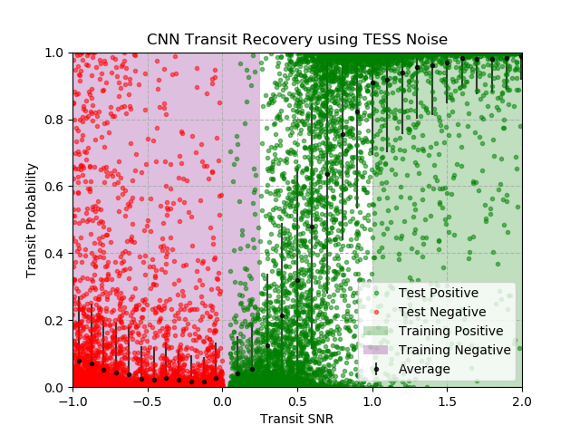

# Artificial intelligence for TESS

## Getting started

I have provided extracted TESS light curves and residuals in the file: `TESS_residuals.pkl`. The data is a dictionary 
with the fields ```{'tic':[],'time':[],'residual':[], 'fluxs':[]}```. See the file `cnn_train.py` for how to create training data based on real noise from TESS. If you use these algorithmspPlease cite: Pearson 2019 https://iopscience.iop.org/article/10.3847/1538-3881/ab4e1c 



A transit injection test using a convolutional neural network on TESS time series.  The neural network was trained using 10000 random light curves with varying SNR where the injected noise was based on the residuals to the TESS light curve fits.  The residuals have the transit signal removed but variations due to instrumental and stellar variability still included.  The shaded regions indicate where in the phase space the CNN algorithm was trained.  Negative SNR regions indicate the transit shape is inverted.  The dots represent data the neural network has not seen before and its predictions.  The black points are transit probabilities averaged over bins of 0.2 SNR. The neural network was cautious in selecting transits and has a 15.7% false negative rate because a high tolerance is used (0.8) for classifying the transit probability.  Additionally, the network has a 1.35% false positive rate only within the conditions tested here and a lower rate for detrended data.  The false positive rate considers low SNR transits,  inverted transit shapes and other sources of systematics from TESS. This CNN algorithm has an average detection accuracy of 99% or more for transits that are at least 1.5× greater than the noise.


## Scientific Justification 
The Transiting Exoplanet Survey Satellite (TESS) is conducting an all-sky photometric survey to discover hundreds of transiting planets around bright stars that are most suitable for mass measurements through radial velocity (RV) observations (Ricker et al. 2015; Ricker et al. 2016).  TESS acquires observations on a 30-minute cadence of all objects in  the  field  of  view  but  increases  the  cadence  to  2-minutes  for  select  bright  stars  with  the  goal  of  detecting  small transiting planets (Stassun et al. 2018).  Each sector of TESS data is observed for 27.4 days (two spacecraft orbits), allowing the survey to cover most of the sky in 2 years.  Simulations have shown that TESS is capable of detecting hundreds of small planets (Sullivan et al. 2015; Bouma et al. 2017; Barclay et al. 2018;). 

The ideal algorithm for detecting planets should be fast, robust to noise and capable of learning and abstracting highly non-linear systems. A neural network (or deep net) trained to recognize planets with photometric data provides the ideal platform.  Deep nets are composed of layers of “neurons”, each of which are associated with different weights to  indicate  the  importance  of  one  input  parameter  compared  to  another. A  neural  network  is  designed  to  make decisions, such as whether or not an observation detects a planet, based on a set of input parameters that treat, e.g.the shape and depths of a light curve, the noise and systematic error, such as star spots.
